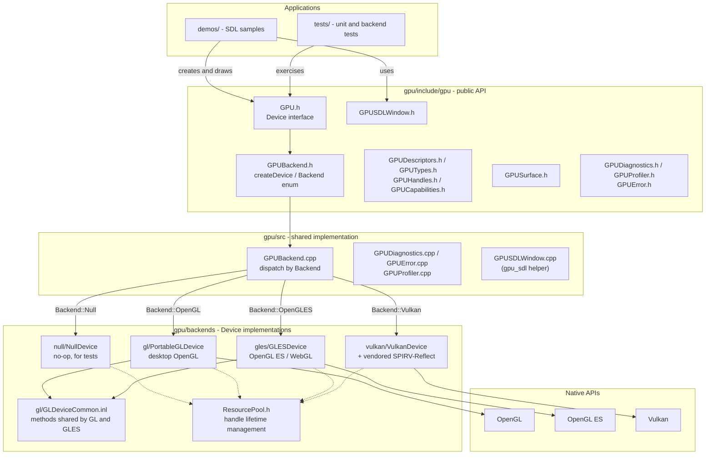

# GPU

`GPU` is a lightweight C++14 graphics abstraction layer with interchangeable
Null, OpenGL, OpenGL ES, and Vulkan backends. Its public API is in
[`gpu/include/gpu`](gpu/include/gpu); demos and tests are kept at the
repository root.

## Features

- Single `gpu::Device` interface for buffers, textures, samplers, pipelines,
  render passes, and draw/dispatch calls.
- Backend selection at device-creation time (`gpu::Backend::Null`, `OpenGL`,
  `OpenGLES`, `Vulkan`), so application code never depends on a specific
  graphics API.
- Capability querying (`GPUCapabilities`) to check what a backend supports
  before relying on optional features (compute, storage buffers/textures,
  texture compression, indirect draw, etc.).
- Built-in error reporting (`GPUError`), logging/diagnostics
  (`GPUDiagnostics`), and GPU timing (`GPUProfiler`).
- Optional SDL2 window helper (`gpu_sdl`, header `gpu/GPUSDLWindow.h`) that
  owns the platform surface/context, so applications never touch `SDL_GL_*`
  directly.
- Resource pooling helper (`ResourcePool`) used internally by backends to
  manage handle lifetimes.

## Repository layout

```text
gpu/        Library sources, public headers, backends, and CMake entry point
demos/      SDL-based rendering samples and their shaders
tests/      Unit, integration, and backend tests
docs/       Project and API documentation
```

## Architecture



- `gpu::createDevice` (in `GPUBackend.cpp`) picks the concrete backend from
  `DeviceDesc::backend` and returns the matching `Device` implementation.
- The desktop OpenGL and OpenGL ES backends share the identical parts of the
  `Device` implementation through `gl/GLDeviceCommon.inl`, included once per
  class.
- The Vulkan backend vendors SPIRV-Reflect for pipeline reflection and
  computes it once at pipeline-creation time.
- Applications (`demos/`, `tests/`) only talk to the public API; the optional
  `gpu_sdl` helper owns the SDL window and presentation surface.

## Requirements

- CMake 3.21 or newer
- A C++14-capable compiler
- SDL2 when building demos or context-dependent OpenGL/OpenGL ES tests
- A GLESv2 development library when building the OpenGL ES backend (ANGLE is
  used by the Windows release build)
- Vulkan SDK; `glslangValidator` is additionally required for Vulkan tests or
  demos

## Build and test

The Null backend is enabled by default and is suitable for a portable base
build:

```sh
cmake -S gpu -B build -DBUILD_TESTING=ON
cmake --build build
ctest --test-dir build --output-on-failure
```

## Generate documentation

Install Doxygen and generate the API in three formats:

```sh
cmake -S gpu -B build-docs -DGPU_BUILD_DOCS=ON
cmake --build build-docs --target docs
```

The outputs are `build-docs/docs/html/index.html` (HTML),
`build-docs/docs/generated/api-reference.md` (Markdown), and
`build-docs/docs/generated/api-reference.rst` (reStructuredText).
Use `-DGPU_DOCS_OUTPUT_DIR=$PWD/documentation` to place the same generated
tree in a repository-level `documentation/` directory.

Enable individual backends as needed:

```sh
# OpenGL backend and SDL demos
cmake -S gpu -B build-gl \
  -DGPU_BUILD_OPENGL=ON \
  -DGPU_BUILD_DEMOS=ON

# Vulkan backend and its tests
cmake -S gpu -B build-vulkan \
  -DGPU_BUILD_VULKAN=ON \
  -DBUILD_TESTING=ON
```

## Install and use as a dependency

Build a backend component, install it, then link its exported CMake target.
Each component includes the common runtime and exactly one graphics backend.
This keeps application builds small and makes backend selection explicit.

```sh
cmake -S gpu -B build-release \
  -DCMAKE_BUILD_TYPE=Release \
  -DGPU_BUILD_OPENGL=ON \
  -DGPU_BUILD_VULKAN=ON \
  -DGPU_BUILD_STATIC_LIBRARIES=ON \
  -DGPU_BUILD_SHARED_LIBRARIES=ON
cmake --build build-release --target \
  gpu_gl_static gpu_gl_shared \
  gpu_gles_static gpu_gles_shared \
  gpu_vk_static gpu_vk_shared
cmake --install build-release --prefix /opt/gpu
```

In a consuming project's `CMakeLists.txt`:

```cmake
find_package(GPU CONFIG REQUIRED COMPONENTS gl_shared)

add_executable(my_app main.cpp)
target_link_libraries(my_app PRIVATE GPU::gl_shared)
```

When installed outside a system prefix, configure the consumer with
`-DCMAKE_PREFIX_PATH=/opt/gpu` (or set `GPU_DIR` to
`/opt/gpu/lib/cmake/GPU`).

Choose exactly one component per executable:

| Backend | Static target | Shared target |
| --- | --- | --- |
| OpenGL | `GPU::gl_static` | `GPU::gl_shared` |
| OpenGL ES | `GPU::gles_static` | `GPU::gles_shared` |
| Vulkan | `GPU::vk_static` | `GPU::vk_shared` |

For a local checkout, use `add_subdirectory(path/to/GPU/gpu)` and link the
same target names. Do not link a GL and Vulkan component into the same
executable: each component provides the common `gpu::createDevice` API.

## Releases

Pushing a version tag beginning with `v` triggers the GitHub Actions release
workflow. It publishes Linux (`.tar.gz`) and Windows (`.zip`) packages with
the static and shared OpenGL, OpenGL ES, and Vulkan components.

```sh
git tag v0.1.0
git push origin v0.1.0
```

Useful CMake options:

| Option | Default | Purpose |
| --- | --- | --- |
| `GPU_BUILD_NULL` | `ON` | Build the portable Null backend. |
| `GPU_BUILD_OPENGL` | standalone: `OFF` | Build the OpenGL backend. |
| `GPU_BUILD_OPENGLES` | `OFF` | Build the OpenGL ES backend. |
| `GPU_BUILD_VULKAN` | `OFF` | Build the Vulkan backend. |
| `GPU_BUILD_STATIC_LIBRARIES` | `ON` | Produce static backend components. |
| `GPU_BUILD_SHARED_LIBRARIES` | `OFF` | Produce shared backend components. |
| `GPU_BUILD_DOCS` | `OFF` | Enable the optional Doxygen HTML/Markdown/RST `docs` target. |
| `GPU_BUILD_DEMOS` | `OFF` | Build SDL-based demo applications. |
| `GPU_BUILD_SDL` | `OFF` | Build `gpu_sdl`, the SDL2 window and presentation-surface helper. |
| `GPU_BUILD_OPENGL_TESTS` | `OFF` | Build tests that require a real OpenGL context. |
| `GPU_BUILD_OPENGLES_TESTS` | `OFF` | Build tests that require a real OpenGL ES context. |
| `BUILD_TESTING` | CTest default | Build and register tests. |
| `GPU_ENABLE_SANITIZERS` | `OFF` | Enable AddressSanitizer and UBSan with GCC or Clang. |

`GPU::gles_static` resolves `GLESv2` on the consumer system; use
`find_package(GPU CONFIG REQUIRED COMPONENTS gles_static)` so CMake can report
a missing GLES dependency early.

## Minimal usage

```cpp
#include <gpu/GPU.h>
#include <gpu/GPUBackend.h>

gpu::DeviceDesc descriptor;
descriptor.backend = gpu::Backend::Null;

gpu::GPUError error;
gpu::Device *device = gpu::createDevice(descriptor, &error);
if (device != nullptr) {
    // Create resources and submit work through gpu::Device.
    gpu::destroyDevice(device);
}
```

See [the API documentation plan](docs/API_DOCUMENTATION_PLAN.md) for the
documentation roadmap and source-of-truth headers.

## License

This project is licensed under the [MIT License](LICENSE).
